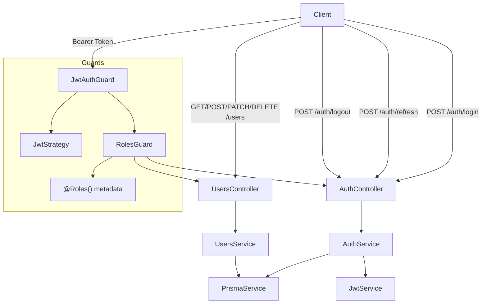
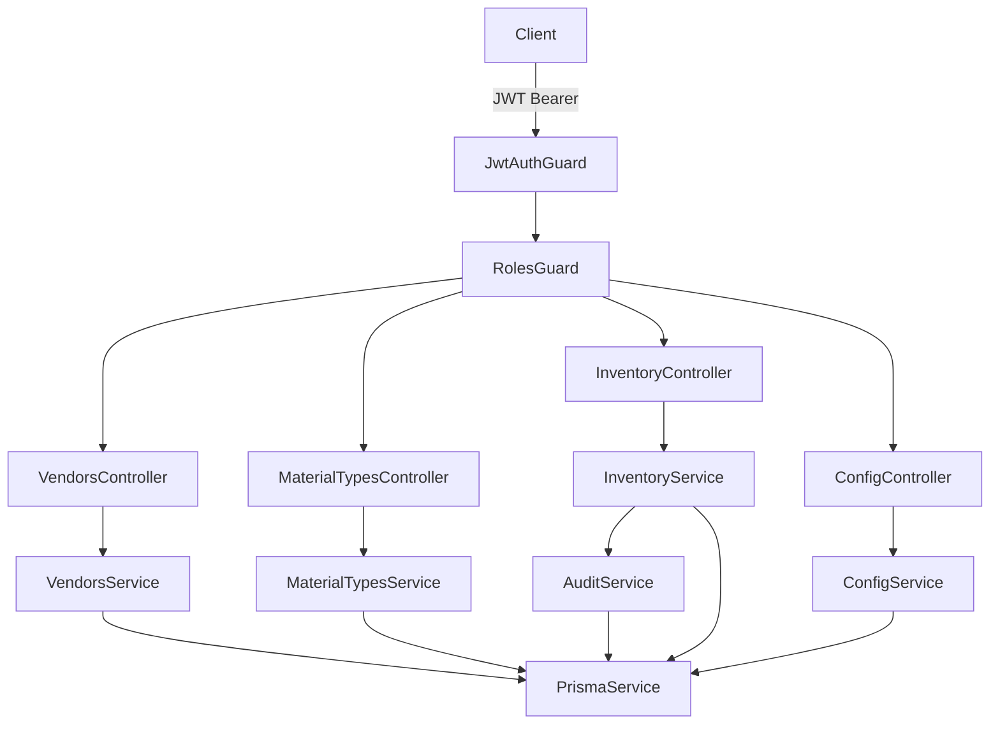

# Design Document: Manufacturing Management System — Phase 1

## Overview

Phase 1 implements authentication, authorization, and user management for the Manufacturing Management System. This provides the security foundation for all subsequent phases.

The system uses JWT-based stateless authentication with refresh token rotation, bcrypt password hashing, and a guard-based authorization model in NestJS. Four roles (ADMIN, CUTTING, STITCHING, IRON) are enforced at the endpoint level via decorators and guards.

## Architecture



**Request Flow:**
1. Client sends request with Bearer token
2. `JwtAuthGuard` validates the JWT signature and expiry
3. `RolesGuard` reads `@Roles()` metadata from the handler and checks user role
4. Controller method executes if both guards pass

## Components and Interfaces

### PrismaModule (Global)

| Component | Responsibility |
|-----------|---------------|
| `PrismaService` | Extends `PrismaClient`, handles connection lifecycle (`onModuleInit`, `onModuleDestroy`) |

Exported globally so all modules can inject it.

### AuthModule

| Component | Responsibility |
|-----------|---------------|
| `AuthController` | Exposes `/auth/login`, `/auth/refresh`, `/auth/logout` |
| `AuthService` | Validates credentials, issues tokens, manages refresh tokens |
| `JwtStrategy` | Passport strategy extracting user from Bearer token |
| `JwtAuthGuard` | Applies `JwtStrategy` to protected routes |
| `RolesGuard` | Reads `@Roles()` decorator metadata, compares to `request.user.role` |
| `@Roles()` decorator | Sets allowed roles as route metadata |

### UsersModule

| Component | Responsibility |
|-----------|---------------|
| `UsersController` | Exposes CRUD endpoints for user management |
| `UsersService` | User creation (with hashing), update, deactivation, listing |

### DTOs

| DTO | Fields | Validation |
|-----|--------|------------|
| `LoginDto` | email, password | `@IsEmail()`, `@IsNotEmpty()` |
| `RefreshTokenDto` | refreshToken | `@IsNotEmpty()` |
| `CreateUserDto` | email, password, name, role | `@IsEmail()`, `@MinLength(6)`, `@IsEnum(Role)` |
| `UpdateUserDto` | name?, role?, isActive? | Optional fields, `@IsEnum(Role)` if present |


### API Endpoints

| Method | Path | Auth | Roles | Description |
|--------|------|------|-------|-------------|
| POST | `/auth/login` | None | Public | Returns `{ accessToken, refreshToken }` |
| POST | `/auth/refresh` | None | Public | Accepts refresh token, returns new access token + rotated refresh token |
| POST | `/auth/logout` | JWT | Any | Invalidates refresh token |
| GET | `/users` | JWT | ADMIN | List all users |
| POST | `/users` | JWT | ADMIN | Create new user |
| PATCH | `/users/:id` | JWT | ADMIN | Update user (name, role, isActive) |
| DELETE | `/users/:id` | JWT | ADMIN | Soft-delete (deactivate) user |

## Data Models

### Prisma Schema

```prisma
enum Role {
  ADMIN
  CUTTING
  STITCHING
  IRON
}

model User {
  id            String         @id @default(uuid())
  email         String         @unique
  password      String
  name          String
  role          Role
  isActive      Boolean        @default(true)
  createdAt     DateTime       @default(now())
  updatedAt     DateTime       @updatedAt
  refreshTokens RefreshToken[]
}

model RefreshToken {
  id        String   @id @default(uuid())
  token     String   @unique
  userId    String
  user      User     @relation(fields: [userId], references: [id])
  expiresAt DateTime
  createdAt DateTime @default(now())
}
```

### Key Design Decisions

| Decision | Choice | Rationale |
|----------|--------|-----------|
| Access token expiry | 15 minutes | Short-lived for security; refresh handles UX |
| Refresh token expiry | 7 days | Balance between security and convenience |
| Refresh token storage | Database | Enables revocation on logout |
| Refresh token rotation | On every use | Prevents replay attacks |
| Password hashing | bcrypt, 10 rounds | Industry standard, good cost/security balance |
| User deletion | Soft-delete (isActive=false) | Preserves referential integrity for future phases |
| Token format | UUID v4 for refresh, JWT for access | JWT is stateless; refresh needs DB lookup anyway |

## Correctness Properties

*A property is a characteristic or behavior that should hold true across all valid executions of a system — essentially, a formal statement about what the system should do. Properties serve as the bridge between human-readable specifications and machine-verifiable correctness guarantees.*

### Property 1: Password hashing round-trip

*For any* valid password string, hashing it with bcrypt and then comparing the original password against the hash SHALL return true.

**Validates: Requirements 1.3**

### Property 2: Admin has universal endpoint access

*For any* protected endpoint in the system, an authenticated user with role ADMIN SHALL receive a non-403 response.

**Validates: Requirements 2.2**

### Property 3: Non-admin roles denied unauthorized endpoints

*For any* user with a non-ADMIN role and *for any* endpoint not assigned to that role, the request SHALL return a 403 Forbidden response.

**Validates: Requirements 2.3, 2.4, 2.5**

### Property 4: Unauthenticated requests denied

*For any* protected endpoint, a request without a valid JWT token SHALL return a 401 Unauthorized response.

**Validates: Requirements 2.6**

### Property 5: Invalid credentials rejected

*For any* credential pair where the password does not match the stored hash, the login attempt SHALL be rejected with an authentication error.

**Validates: Requirements 1.2**

### Property 6: Invalid refresh tokens rejected

*For any* string that is not a valid, non-expired refresh token stored in the database, the token refresh request SHALL be rejected.

**Validates: Requirements 1.5**

### Property 7: Deactivated users cannot login

*For any* user whose isActive field is false, a login attempt with correct credentials SHALL be rejected.

**Validates: Requirements 3.3**

### Property 8: Non-admin users denied user management

*For any* user with role CUTTING, STITCHING, or IRON, attempting any user management operation (create, update, delete) SHALL return a 403 Forbidden response.

**Validates: Requirements 3.4, 3.5**


## Error Handling

| Scenario | HTTP Status | Response Body |
|----------|-------------|---------------|
| Invalid credentials | 401 | `{ statusCode: 401, message: "Invalid credentials" }` |
| Expired/invalid JWT | 401 | `{ statusCode: 401, message: "Unauthorized" }` |
| Insufficient role | 403 | `{ statusCode: 403, message: "Forbidden resource" }` |
| Invalid refresh token | 401 | `{ statusCode: 401, message: "Invalid refresh token" }` |
| Duplicate email on create | 409 | `{ statusCode: 409, message: "Email already exists" }` |
| User not found | 404 | `{ statusCode: 404, message: "User not found" }` |
| Validation failure | 400 | `{ statusCode: 400, message: [...errors] }` |
| Deactivated user login | 401 | `{ statusCode: 401, message: "Account is deactivated" }` |

All errors use NestJS `HttpException` subclasses for consistent formatting via the built-in exception filter.

## Testing Strategy

### Unit Tests
- `AuthService`: login logic, token generation, refresh token rotation, logout invalidation
- `UsersService`: create user (hashing), update, deactivate, list
- `RolesGuard`: role checking logic with various role/endpoint combinations
- `JwtStrategy`: token extraction and validation

### Property-Based Tests (fast-check)
- **Library**: `fast-check` (TypeScript PBT library)
- **Minimum iterations**: 100 per property
- **Tag format**: `Feature: manufacturing-management-system, Property N: <title>`

Properties to implement:
1. Password hashing round-trip (pure function test)
2. RolesGuard: admin access (guard logic test with mocked execution context)
3. RolesGuard: non-admin denial (guard logic test)
4. JwtAuthGuard: unauthenticated denial (guard logic test)
5. AuthService: invalid credentials rejection
6. AuthService: invalid refresh token rejection
7. AuthService: deactivated user rejection
8. RolesGuard: non-admin user management denial

### Integration Tests (e2e with supertest)
- Full login → access → refresh → logout flow
- Admin creates user → user logs in → accesses allowed endpoint
- Role change takes effect on next auth check
- Deactivated user cannot login

### Test Infrastructure
- `@nestjs/testing` for module compilation
- In-memory SQLite or test PostgreSQL for integration tests
- `supertest` for HTTP-level e2e tests


---

# Design Document: Manufacturing Management System — Phase 2

## Overview

Phase 2 implements inventory management for the Manufacturing Management System. This covers cloth roll CRUD, vendor and material type management, inventory transaction tracking, leftover threshold configuration, and audit logging for inventory changes.

This phase builds on Phase 1's authentication and authorization infrastructure — all endpoints require JWT auth and ADMIN role.

## Architecture



**Module Dependency:**
- `AuditModule` is a shared module exporting `AuditService` (used by InventoryModule and future modules)
- `VendorsModule`, `MaterialTypesModule`, `InventoryModule`, `ConfigModule` are feature modules
- All modules use the global `PrismaModule` for database access
- All controllers use `JwtAuthGuard` + `RolesGuard` with `@Roles(Role.ADMIN)`

## Components and Interfaces

### AuditModule (Shared)

| Component | Responsibility |
|-----------|---------------|
| `AuditService` | Creates `InventoryTransaction` records when roll meters change. Extensible for future audit needs. |

### VendorsModule

| Component | Responsibility |
|-----------|---------------|
| `VendorsController` | Exposes `GET /vendors`, `POST /vendors`, `PATCH /vendors/:id` |
| `VendorsService` | CRUD operations for vendors, duplicate name validation |

### MaterialTypesModule

| Component | Responsibility |
|-----------|---------------|
| `MaterialTypesController` | Exposes `GET /material-types`, `POST /material-types`, `PATCH /material-types/:id` |
| `MaterialTypesService` | CRUD operations for material types, duplicate name validation |

### InventoryModule

| Component | Responsibility |
|-----------|---------------|
| `InventoryController` | Exposes roll CRUD, transaction history endpoints |
| `InventoryService` | Roll creation, editing (with audit), assignment logic, meter tracking, leftover handling |

### ConfigModule

| Component | Responsibility |
|-----------|---------------|
| `ConfigController` | Exposes `GET /config/leftover-threshold`, `PUT /config/leftover-threshold` |
| `ConfigService` | Read/write `SystemConfig` entries (key-value store for app settings) |

### DTOs

| DTO | Fields | Validation |
|-----|--------|------------|
| `CreateVendorDto` | name | `@IsNotEmpty()`, `@IsString()` |
| `UpdateVendorDto` | name? | `@IsOptional()`, `@IsString()` |
| `CreateMaterialTypeDto` | name | `@IsNotEmpty()`, `@IsString()` |
| `UpdateMaterialTypeDto` | name? | `@IsOptional()`, `@IsString()` |
| `CreateRollDto` | rollCode, vendorId, materialTypeId, color, shade?, gsm, initialMeters, cost, purchaseDate | All validated with appropriate decorators |
| `UpdateRollDto` | color?, shade?, gsm?, cost?, remainingMeters? | Optional fields, `remainingMeters` change triggers transaction |
| `SetThresholdDto` | value | `@IsNumber()`, `@Min(0)` |

### API Endpoints

| Method | Path | Auth | Roles | Description |
|--------|------|------|-------|-------------|
| GET | `/vendors` | JWT | ADMIN | List all vendors |
| POST | `/vendors` | JWT | ADMIN | Create vendor |
| PATCH | `/vendors/:id` | JWT | ADMIN | Update vendor |
| GET | `/material-types` | JWT | ADMIN | List all material types |
| POST | `/material-types` | JWT | ADMIN | Create material type |
| PATCH | `/material-types/:id` | JWT | ADMIN | Update material type |
| GET | `/inventory/rolls` | JWT | ADMIN | List all rolls (with filters: vendor, materialType, color, isAssigned) |
| GET | `/inventory/rolls/:id` | JWT | ADMIN | Get roll details with vendor and materialType populated |
| POST | `/inventory/rolls` | JWT | ADMIN | Add new roll (sets remainingMeters = initialMeters) |
| PATCH | `/inventory/rolls/:id` | JWT | ADMIN | Edit roll details (meter changes create transaction) |
| GET | `/inventory/rolls/:id/transactions` | JWT | ADMIN | Get chronological transaction history |
| GET | `/config/leftover-threshold` | JWT | ADMIN | Get current leftover threshold value |
| PUT | `/config/leftover-threshold` | JWT | ADMIN | Set leftover threshold value |


## Data Models

### Prisma Schema Additions

```prisma
model Vendor {
  id        String          @id @default(uuid())
  name      String          @unique
  createdAt DateTime        @default(now())
  updatedAt DateTime        @updatedAt
  rolls     InventoryRoll[]
}

model MaterialType {
  id        String          @id @default(uuid())
  name      String          @unique
  createdAt DateTime        @default(now())
  updatedAt DateTime        @updatedAt
  rolls     InventoryRoll[]
}

model InventoryRoll {
  id              String                 @id @default(uuid())
  rollCode        String                 @unique
  vendorId        String
  vendor          Vendor                 @relation(fields: [vendorId], references: [id])
  materialTypeId  String
  materialType    MaterialType           @relation(fields: [materialTypeId], references: [id])
  color           String
  shade           String?
  gsm             Float
  initialMeters   Float
  remainingMeters Float
  cost            Float
  purchaseDate    DateTime
  isAssigned      Boolean                @default(false)
  createdAt       DateTime               @default(now())
  updatedAt       DateTime               @updatedAt
  transactions    InventoryTransaction[]
}

model InventoryTransaction {
  id        String        @id @default(uuid())
  rollId    String
  roll      InventoryRoll @relation(fields: [rollId], references: [id])
  oldValue  Float
  newValue  Float
  reason    String
  userId    String
  createdAt DateTime      @default(now())
}

model SystemConfig {
  id    String @id @default(uuid())
  key   String @unique
  value String
}
```

### Key Design Decisions

| Decision | Choice | Rationale |
|----------|--------|-----------|
| Vendor/MaterialType as separate models | Normalized tables | Enables consistent references, prevents typos, supports future filtering |
| InventoryTransaction.userId as String | Not a FK to User | Keeps audit decoupled; userId is recorded for traceability but doesn't constrain deletion |
| SystemConfig as key-value | Generic config table | Avoids schema changes for new settings (leftover threshold, future configs) |
| isAssigned as boolean flag | Simple flag on roll | Sufficient for Phase 2; Phase 3 will add the batch FK relationship |
| remainingMeters set on create | Equals initialMeters | New rolls start with full meters available |
| Transaction on meter change | Automatic via service | Every `remainingMeters` update goes through InventoryService which creates the transaction |

## Correctness Properties

*A property is a characteristic or behavior that should hold true across all valid executions of a system — essentially, a formal statement about what the system should do. Properties serve as the bridge between human-readable specifications and machine-verifiable correctness guarantees.*

### Property 1: Roll creation round-trip

*For any* valid roll data (rollCode, vendor, materialType, color, gsm, initialMeters, cost, purchaseDate), creating a roll and then reading it back SHALL return all fields unchanged, with remainingMeters equal to initialMeters.

**Validates: Requirements 4.1**

### Property 2: Roll edit creates audit transaction

*For any* roll and any edit that changes remainingMeters, the system SHALL create an InventoryTransaction record with the correct oldValue, newValue, and reason.

**Validates: Requirements 4.2, 5.1**

### Property 3: Remaining meters invariant

*For any* roll with an initial value and any sequence of meter-change transactions applied, remainingMeters SHALL equal initialMeters minus the sum of all deductions plus the sum of all returns.

**Validates: Requirements 4.3**

### Property 4: Assignment exclusivity

*For any* roll that is currently assigned (isAssigned=true), attempting to assign it to another batch SHALL be rejected, and the roll's state SHALL remain unchanged.

**Validates: Requirements 4.4, 4.5**

### Property 5: Assignment release restores availability

*For any* roll, assigning it and then releasing it SHALL result in isAssigned=false, and the roll SHALL be assignable again.

**Validates: Requirements 4.6**

### Property 6: Leftover threshold determines return behavior

*For any* leftover amount and any threshold value, if leftover > threshold then remainingMeters SHALL increase by the leftover amount; if leftover <= threshold then remainingMeters SHALL remain unchanged.

**Validates: Requirements 5.2, 5.3**

### Property 7: Transaction history is chronological

*For any* roll with multiple transactions, querying the transaction history SHALL return records ordered by createdAt ascending.

**Validates: Requirements 5.4**


## Error Handling

| Scenario | HTTP Status | Response Body |
|----------|-------------|---------------|
| Duplicate vendor name | 409 | `{ statusCode: 409, message: "Vendor already exists" }` |
| Duplicate material type name | 409 | `{ statusCode: 409, message: "Material type already exists" }` |
| Duplicate roll code | 409 | `{ statusCode: 409, message: "Roll code already exists" }` |
| Vendor not found | 404 | `{ statusCode: 404, message: "Vendor not found" }` |
| Material type not found | 404 | `{ statusCode: 404, message: "Material type not found" }` |
| Roll not found | 404 | `{ statusCode: 404, message: "Roll not found" }` |
| Roll already assigned | 409 | `{ statusCode: 409, message: "Roll is already assigned to a batch" }` |
| Invalid vendor/material reference | 400 | `{ statusCode: 400, message: "Invalid vendorId or materialTypeId" }` |
| Negative remaining meters | 400 | `{ statusCode: 400, message: "Remaining meters cannot be negative" }` |
| Validation failure | 400 | `{ statusCode: 400, message: [...errors] }` |

All errors use NestJS `HttpException` subclasses for consistent formatting.

## Testing Strategy

### Unit Tests
- `VendorsService`: create, list, update, duplicate name handling
- `MaterialTypesService`: create, list, update, duplicate name handling
- `InventoryService`: roll CRUD, meter change transaction creation, assignment/release logic, leftover threshold logic
- `ConfigService`: get/set threshold
- `AuditService`: transaction record creation

### Property-Based Tests (fast-check)
- **Library**: `fast-check` (TypeScript PBT library)
- **Minimum iterations**: 100 per property
- **Tag format**: `Feature: manufacturing-management-system, Property N: <title>`

Properties to implement:
1. Roll creation round-trip (service-level test with mocked Prisma)
2. Roll edit creates audit transaction (verify transaction creation on meter change)
3. Remaining meters invariant (generate transaction sequences, verify final state)
4. Assignment exclusivity (attempt double-assign, verify rejection)
5. Assignment release restores availability (assign → release → verify available)
6. Leftover threshold determines return behavior (vary leftover and threshold, verify correct branch)
7. Transaction history is chronological (generate multiple transactions, verify ordering)

### Integration Tests
- Full roll lifecycle: create → edit meters → verify transaction → query history
- Vendor/material type CRUD with duplicate handling
- Assignment flow: assign → reject double-assign → release → re-assign
- Leftover threshold: set threshold → process leftover above → verify return; process below → verify waste
- Config endpoint: get default → set new value → get updated

### Test Infrastructure
- Reuse Phase 1 test setup (`@nestjs/testing` + `supertest`)
- `fast-check` for property-based tests (already installed in Phase 1)
- Test database with seeded vendors and material types for integration tests
